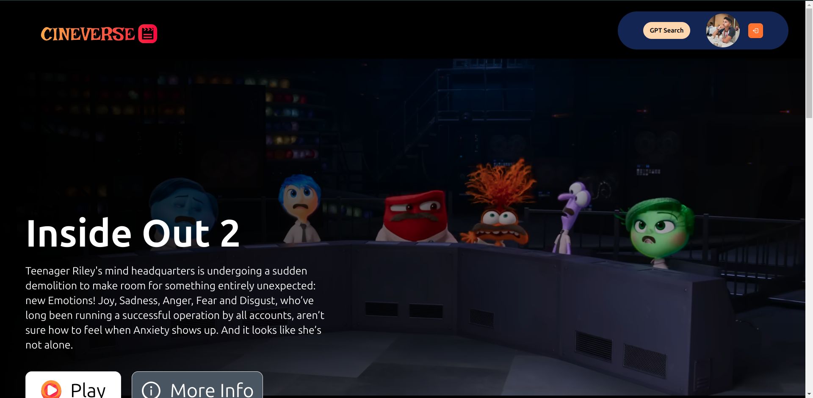
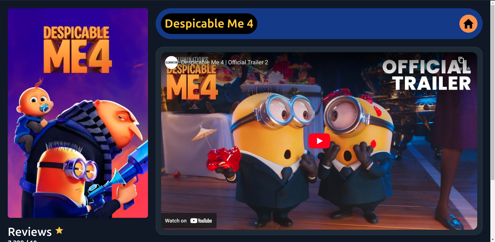

# CineverseGPT 🎬

Welcome to **CineverseGPT**, a React-based application that integrates the Gemini API and Tmdb API to provide a dynamic movie search experience. This project demonstrates the capabilities of React and modern web technologies.





## Features

- **Login/Signup Page**: Secure authentication using Firebase.
- **Browse Page**: Explore a wide selection of movies.
- **GptSearch Page**: Search for movies using GPT prompts.
- **Movie Page**: View detailed information about selected movies.
- **Mobile Friendly**: Fully responsive design for seamless use on any device.



## Technologies Used

- **React**: Frontend framework for building the user interface.
- **Firebase**: Authentication and hosting.
- **Gemini API**: GPT integration for search functionality.
- **Tmdb API**: Fetch movie data, including images and trailers.

## Live Link

Explore the live application here: [CineverseGPT](https://cineversegpt-a66af.web.app/)

## GitHub Repository

Check out the source code and more details at the GitHub repository: [CineverseGPT GitHub Repo](https://github.com/anuj846k/cineverse-gpt)

## Login Credentials

If you prefer not to sign up, you can use the following credentials to access the app:

- **Email**: anuj456@gmail.com
- **Password**: Movie@9090

## Getting Started

To run this project locally:

1. **Clone the Repository**
   ```bash
   git clone https://github.com/anuj846k/cineverse-gpt


## Contributing

If you would like to contribute to this project, please feel free to submit a pull request or open an issue.